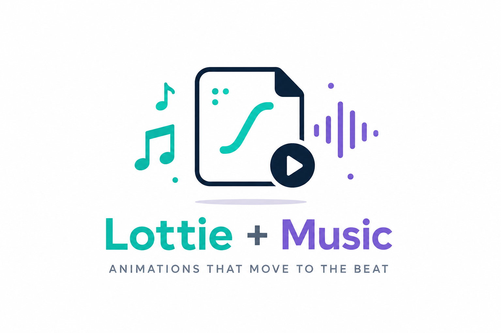

<div align="center">

</div>

# Lottie Music Animation Collection

A creative collection of **Lottie animations combined with music**, exploring how motion graphics and sound can work together to create engaging visual experiences.

This repository contains animation experiments and visual compositions created by combining Lottie-based motion with music and audio. The goal is to explore the relationship between **animation, rhythm, timing, and sound**.

Lottie is a JSON-based animation format designed to represent vector graphics and their motion over time, making it well suited for lightweight, scalable animated experiences. citeturn0search0turn0search8

## ✨ Features

- 🎬 **Lottie Animations** — Interactive and lightweight vector-based animations.
- 🎵 **Music Integration** — Animations are paired with music to create synchronized visual experiences.
- ⏱️ **Animation & Audio Timing** — Visual motion can be coordinated with musical timing and transitions.
- 🎨 **Creative Visual Experiments** — A collection of different animation styles, compositions, and concepts.
- ⚡ **Lightweight Animation Format** — Lottie animations are represented using JSON rather than traditional frame-by-frame video.
- 🧩 **Reusable Assets** — Individual animations can be reused and adapted for other creative projects.
- 💻 **Web-Friendly** — Lottie animations can be rendered in web-based experiences using compatible players.

## 🛠️ Technologies & Tools

Depending on the individual animation, this collection may use:

- **Lottie**
- **Lottie JSON**
- **HTML5**
- **CSS3**
- **JavaScript**
- **Lottie Web Player**
- **Audio / Music**
- **Adobe After Effects / Bodymovin** where applicable

Lottie animations are JSON documents containing animation information such as layers, assets, dimensions, frame rate, and timing data. 

## 🎵 The Concept

The main idea behind this repository is simple:

**Turn music into a visual experience.**

Instead of treating animation and music as separate elements, each composition combines the two to create a more immersive experience.

The animations can respond to the feeling, rhythm, energy, or structure of a track, creating a visual layer that complements the audio.

This makes the project a small exploration of **motion design + music + interactive media**.

## 🎬 How Lottie Works

Lottie stores animation data as JSON. The animation describes elements such as layers, assets, keyframes, dimensions, frame rate, and timing. citeturn0search0turn0search6

A typical workflow looks like this:

```text
Create / Select Animation
          ↓
Export as Lottie
          ↓
Load Lottie Animation
          ↓
Add Music / Audio
          ↓
Synchronize Timing
          ↓
Create Visual Experience
```

## 🔊 Combining Lottie With Music

The music layer adds another dimension to the animation.

Depending on the composition, synchronization can be based on:

- 🎵 Beat timing
- 🥁 Rhythm changes
- 🎼 Musical sections
- 📈 Energy changes
- ⏱️ Animation keyframes
- ✨ Visual transitions
- 🔁 Loop points

The objective is not necessarily to make every animation react to every beat, but to make the **overall visual rhythm feel connected to the music**.

## 🚀 Running the Animations

If the repository contains a web-based preview, open the relevant HTML file in a browser.

For development, you can use **Visual Studio Code** with a local development server such as Live Server.

For a basic Lottie web implementation, a compatible Lottie player can load a Lottie JSON animation and render it in the browser.

Example concept:

```html
<div id="animation"></div>
```

```javascript
lottie.loadAnimation({
    container: document.getElementById("animation"),
    renderer: "svg",
    loop: true,
    autoplay: true,
    path: "./animations/animation.json"
});
```

> The exact implementation depends on the player and structure used by each animation in this repository.

## 🎨 Creative Direction

This collection focuses on experimenting with:

- Motion and rhythm
- Visual storytelling
- Minimal animation
- Abstract motion graphics
- Music-driven experiences
- Timing and transitions
- Composition and visual balance

Each animation can be treated as an individual experiment rather than simply a standalone graphic.

## 🧠 What This Project Demonstrates

This project explores several useful concepts:

- Understanding the Lottie animation format
- Working with JSON-based animation assets
- Embedding animations into web experiences
- Combining visual motion with audio
- Timing animations against music
- Designing visual experiences around sound
- Building reusable animation components
- Experimenting with motion design

## 🔧 Customization

You can create your own variations by changing:

### Animation

Replace the existing Lottie JSON file with another compatible animation.

### Music

Use a different audio track and adjust the animation timing to match its rhythm and structure.

### Playback

Experiment with:

- Playback speed
- Looping
- Animation duration
- Start and end points
- Trigger-based playback

### Visual Presentation

Customize the surrounding experience with:

- Backgrounds
- Typography
- Gradients
- Layouts
- UI controls
- Visual effects

## 📱 Possible Use Cases

Lottie + music combinations can be used for:

- 🎧 Music visualizers
- 🎵 Album artwork experiences
- 🌐 Interactive landing pages
- 📱 Mobile app experiences
- 🎮 Game interfaces
- 📺 Digital displays
- 🎨 Creative portfolios
- 📢 Social media content
- 🖥️ Interactive installations
- ✨ Experimental digital art

## ⚡ Why Lottie?

Lottie provides a convenient way to represent vector animation as structured data and render it across compatible platforms. Its JSON-based format makes animation assets easy to integrate into applications and web experiences. citeturn0search0turn0search5

## 📚 Resources

- **Lottie Animation Specification:** https://lottie.github.io/lottie-spec/
- **Lottie Documentation:** https://lottiefiles.github.io/lottie-docs/
- **Lottie JSON Documentation:** https://docs.lottiefiles.com/en/format/lottie-json

## ⚠️ Music & Asset Credits

Please make sure that any music, sound effects, Lottie assets, images, fonts, or other third-party resources included in the repository are used according to their respective licenses.

Where applicable, provide attribution to the original creators.

## 📄 License

The code and original creative work in this repository are subject to the license specified by the repository owner.

Third-party animation assets, music, artwork, fonts, and other resources may have separate licenses and are **not automatically covered** by the repository's license.

---

## ⭐ About This Collection

This repository is a collection of experiments exploring what happens when **motion graphics meet music**.

The goal is to keep experimenting, combining different animations and sounds, and creating visual experiences that feel as expressive as the music itself.

**Built with motion, sound, and creativity. 🎨🎵**
